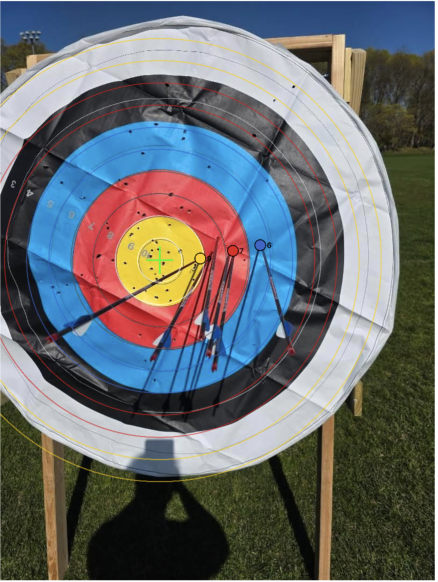
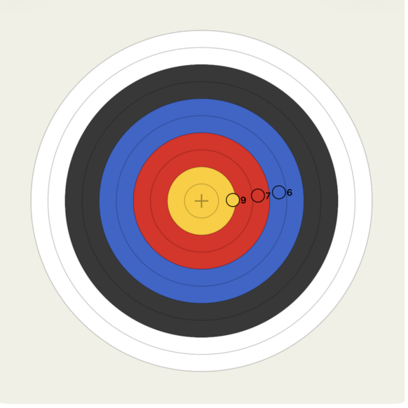

# ArcheryScore

An iOS app that automatically scores archery sessions from a single photo using computer vision. Assumes you take a fairly centered photo of the target.

---

## How It Works

1. **Select a photo** of your archery target
2. The app detects the target rings using color segmentation
3. A YOLOv8 pose model detects each arrow tip
4. Scores are calculated using standard WA ring distances
5. Results are shown on both the original photo and a clean 2D target view

---

## Scoring a Session

1. Open the app and tap **Choose Photo**
2. Select a photo of your target from your camera roll
3. Tap **Score Arrows**
4. View your results — the photo shows detected arrows overlaid with ring boundaries and scores

| Photo View | 2D Target View |
|---|---|
|  |  |

---

## Editing Results

The app may not detect every arrow, especially in crowded targets. You can manually correct results on either view:

- **Tap** anywhere on the image to add an arrow tip
- **Hold** on an arrow tip to remove it
- Switch between the photo and 2D target view using the segmented picker — edits on either view stay in sync
- Tap **Done** to save the session

---

## History

Saved sessions appear in the **History** tab as a grid of 2D target thumbnails. Tap any session to view it. Tap the **Edit** button to add or remove arrows from a saved session.

---

## Tips for Best Results

- Center the target in the frame before taking the photo
- Make sure the gold zone is visible — the detector uses it to locate the target
- Good lighting helps — avoid heavy shadows across the face of the target
- If the target is not detected, you can still add arrows manually on the 2D view

---

## Training Your Own Model

The `training_cleaning/` folder contains the full ML pipeline:

| File | Purpose |
|---|---|
| `cleaning.py` | Builds `yolo_data/` from annotated archive and new datasets |
| `train.ipynb` | Trains YOLOv8s-pose on Google Colab and exports to CoreML |

### Steps

1. Annotate your data
2. Run `python3 cleaning.py` locally to generate `yolo_data/`
3. Zip `yolo_data/` and upload to Google Drive under `MyDrive/Archery/`
4. Open `train.ipynb` in Google Colab and run all cells
5. The final cell exports `best.mlpackage` — download it from Drive
6. Replace `ArcheryScore/Models/best.mlpackage` in Xcode with your new model
